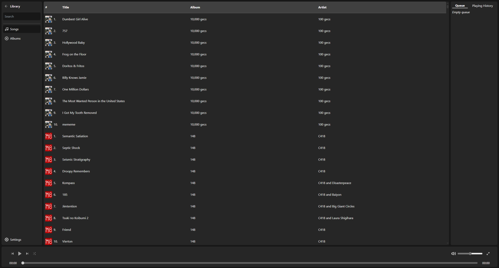

# VITE MUSIC

## Overview

This is a local-only music player 🎶. It creates an internal library from a specified
set of local folders and allows you to browse songs and albums, search through them and
queue thousands of songs at a time.

This is written in Rust 🦀 and Typescript . The aim is to have a clean, adaptable UI
while supporting efficient playback with full cross-platform support. Minimal bloat,
maximum performance.

## Features

Music playback features:

- [X] Gapless playback
- [X] Support for all main music file formats (MP3, FLAC, AAC, WAV, etc)
- [X] Shuffle support
- [X] Large, efficient queue support
- [ ] Replay gain support

App features:

- [X] Full cross-platform support
- [X] Multiple-folder library support
- [X] Fully responsive design for small screens
- [X] Scanning and full handling of folder-based album art
- [ ] Scanning and handling of embedded album art
- [X] Native OS media controls integration (media control shortcuts, currently playing media preview)
- [X] Support for searching albums and songs by artist name, song name and album name
- [X] Intelligently populates queue based on screen song started playing from
- [X] Full support for light, dark and system color scheme

## Installation

Currently, this is not in any package managers (and probably will not be for a while - I
have very limited free time, so will do it when I can). The current options are either to
build from source, or download a pre-compiled binary from the [GitHub Releases page]().

To build from source, please see the instructions [here](#building-from-source).

## Screenshots

## Building From Source

## Issues

There will likely be small bugs here and there - I do my best to address them, but
the nature of this app as a side-project means that some will inevitably fall through the
cracks. If you find a bug, please feel free to open an issue, and I will take a look at it
when I have time.
